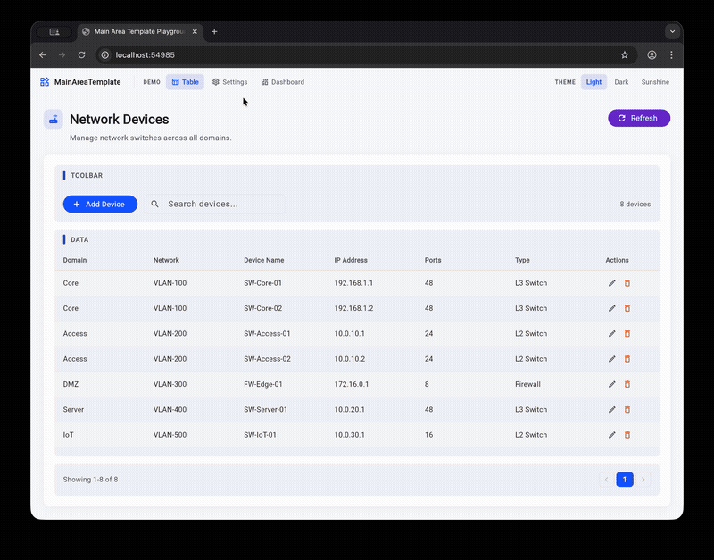

# flutter_page_scaffold

A reusable Flutter widget package for consistent, theme-aware main content area layouts. Provides structured page templates with bold titles, section headers with accent bars, and grouped content cards.



## Features

- **MainAreaTemplate** -- Page-level wrapper with large title, description, icon, and action buttons
- **MainAreaSection** -- Grouped content card with accent-bar section headers
- **Fully theme-aware** -- All colors derived from `Theme.of(context)`, works with any `ThemeData`
- **Zero dependencies** -- Only requires Flutter SDK

## Installation

Add as a path dependency in your `pubspec.yaml`:

```yaml
dependencies:
  flutter_page_scaffold:
    path: ../flutter_page_scaffold
```

Then run:

```bash
flutter pub get
```

## Usage

### Basic page layout

```dart
import 'package:flutter_page_scaffold/flutter_page_scaffold.dart';

MainAreaTemplate(
  title: 'Network Devices',
  description: 'Manage network switches across all domains.',
  icon: Icons.router,
  actions: [
    FilledButton.icon(
      onPressed: () {},
      icon: const Icon(Icons.add),
      label: const Text('Add'),
    ),
  ],
  child: Column(
    children: [
      MainAreaSection(
        label: 'TOOLBAR',
        child: Row(children: [/* toolbar content */]),
      ),
      const SizedBox(height: 12),
      MainAreaSection(
        label: 'DATA',
        expanded: true,
        child: MyDataTable(),
      ),
    ],
  ),
)
```

### Settings page layout

```dart
MainAreaTemplate(
  title: 'Log Settings',
  description: 'Configure log storage and retention policies.',
  icon: Icons.settings_outlined,
  child: Column(
    children: [
      MainAreaSection(
        label: 'STORAGE LIMITS',
        child: MyFormFields(),
      ),
      const SizedBox(height: 16),
      MainAreaSection(
        label: 'STATUS',
        child: MyStatusWidget(),
      ),
    ],
  ),
)
```

## API Reference

### MainAreaTemplate

| Property | Type | Required | Description |
|---|---|---|---|
| `title` | `String` | Yes | Large bold page title |
| `description` | `String?` | No | Subtle muted subtitle below the title |
| `icon` | `IconData?` | No | Icon displayed before the title in a tinted container |
| `actions` | `List<Widget>?` | No | Action buttons displayed to the right of the title |
| `child` | `Widget` | Yes | Main content, typically a Column of `MainAreaSection` widgets |
| `outerPadding` | `EdgeInsetsGeometry?` | No | Padding around the template (default: 24) |
| `cardPadding` | `EdgeInsetsGeometry?` | No | Padding inside the content card (default: 20) |

### MainAreaSection

| Property | Type | Required | Description |
|---|---|---|---|
| `label` | `String?` | No | Uppercase section header with accent bar. Hidden if null |
| `child` | `Widget` | Yes | Section content |
| `padding` | `EdgeInsetsGeometry?` | No | Padding around content (default: 16) |
| `expanded` | `bool` | No | If true, fills remaining space in a Column (default: false) |

## Theme Integration

All colors are pulled from `Theme.of(context).colorScheme`:

| Widget element | Color token |
|---|---|
| Page background | `scaffoldBackgroundColor` |
| Content card | `surface` |
| Section background | `surfaceContainerHighest` |
| Accent bar | `primary` |
| Title text | `onSurface` |
| Description text | `onSurfaceVariant` |
| Section header text | `onSurfaceVariant` |
| Card shadow | `shadow` (6% opacity) |

Works out of the box with light, dark, or any custom `ThemeData`.

## Example

A playground app is included in `example/`. Run it with:

```bash
cd example
flutter run -d chrome
```

The playground demonstrates three page layouts (table, settings, dashboard) with a theme switcher to preview light, dark, and sunshine themes.

## License

MIT
